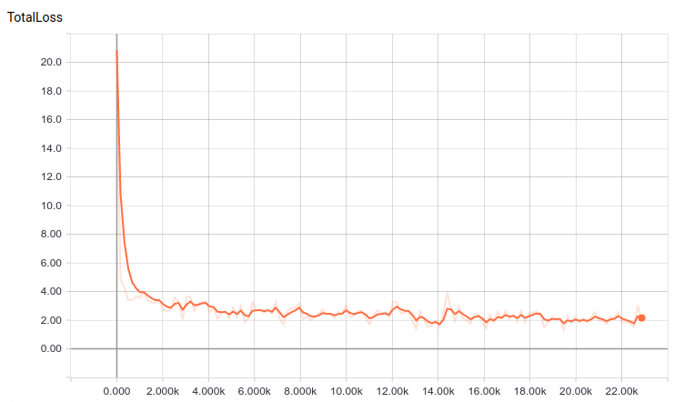

### Setup

* tensorflow 1.3.0
* tensorflow models, at edcd29f commit so it's compatible with tensorflow 1.3
    * `git clone https://github.com/tensorflow/models.git`
    * `git checkout edcd29f`
    * `git checkout -b [some_branch_name]`
    * setup object detection stuff: https://github.com/tensorflow/models/blob/master/research/object_detection/g3doc/installation.md
    * make sure to set `PYTHONPATH` according to above document

### Model checkpoint

Pretrained model checkpoints are in the tensorflow detection model zoo: https://github.com/tensorflow/models/blob/master/research/object_detection/g3doc/detection_model_zoo.md

Tried `ssd_mobilenet_v1_coco`, but it doesn't work on small features because mobilenet uses 300 pixel input.

Current model was trained based on `ssd_inception_v2_coco`. Download pretrained checkpoin from model zoo, and extract it into `models` (`.pb` file should be in `models/ssd_inception_v2_coco_2017_11_17`).

### TFRecords

Training and evaluation uses `TFRecords` for input. The following files go into `data`:
* `train.record`
* `eval.record`
* `label_map.pbtxt` - class labels

Records are labeled images from Bosch TL dataset, `udacity_succesful_light_detection.bag` and `traffic_light_training.bag`.

### Training

From `object_detection` folder. Make sure `PYTHONPATH` is set as per above doc.

* `./train` - train model, I let it run to ~23k steps
* `./eval` - this can run at same time as training
* `tensorboard --logdir=models/train` - train tensorboard
* `tensorboard --port 6007 --logdir=models/eval` - eval tensorboard (pretty cool shows images with bboxes at current state)
*

If training on GPU, eval can still run on CPU, just disable GPU with `source gpu_disable` in the eval shell.

Total loss for 2 class training.

### Export trained model

To export trained model from a checkpoint, run:

`./export_graph [checkpoint id]`

Checkpoint id comes from the checkpoint file name in `models/train`: `model.ckpt-[checkpoint_id].data-00000-of-00001`

The frozen graph saves to `output_inference_graph.pb`.

### Run detection on test images

Put test in `test_images`. Annotated images will be saved in `test_ouput`.

`python test.py`

### Numbers

Red/green data:

  | Red | Green|
--|--|--
train | 651 | 1320
eval | 44 | 106

Red only data:

  | Red |
--|--
train | 651
eval | 44

   | GPU | CPU|
---|-----|----
Red,Green | 40fps | 11fps
Red, Green (half res) | 42fps | 12fps
Red only | 41fps | 11fps
Red only (half res) | 41fps | 12fps

(Using gtx1050i GPU with 4gb, ryzen 7 1700 CPU.)

### Misc stuff

* `clear` deletes train and eval checkpoints, and copies TFRecords from conversion output
* `source gpu_enable` enables GPU for tensorflow
* `source gpu_disable` disables GPU for tensorflow
* `label_map_util.py` and `visualization_utils.py` came from the tensorflow models repo, for some reason python was refusing to export them from there
* `test`, `eval` and `export_graph` have commands for 2 class (red, green) and red only (`vi` and comment/uncomment as needed)
* `.config` files set number of classes, data, trn, eval paths
